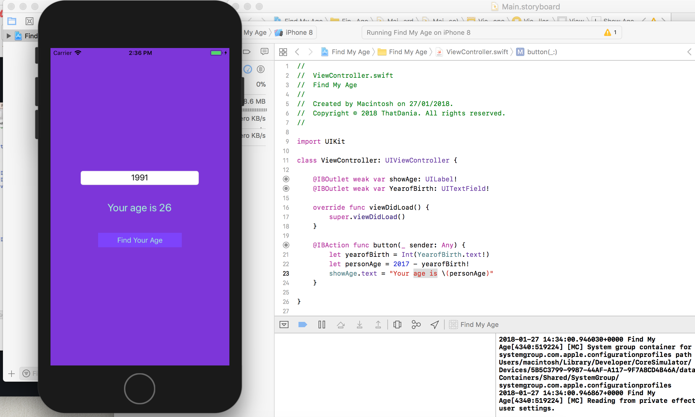

# GettingSwiftyWithAge



This was a repo made after attending my first coding app otherwise known as
PLIBMTTBHGATY. I decided to take on SWIFT and get the basics of how this works.
My end result is that I created an app that calculates your age in dependant
of the year you were born in .

## How To Use
This is under my belief and assumption, hence the instructions to download it may be wrong. But hey, why not give it a try.

Note: You need Xcode 9.3 beta along with the latest software of your MAC.

1. Clone the project

```
git clone https://github.com/thatdania/GettingSwifty.git
```

2. Change into the project directory

```
cd GettingSwifty
```

3. Open this project up in Xcode.
4. Run the play button.

Should all work, hahahaha (first trial ok guys please)🧙‍♀️ 
